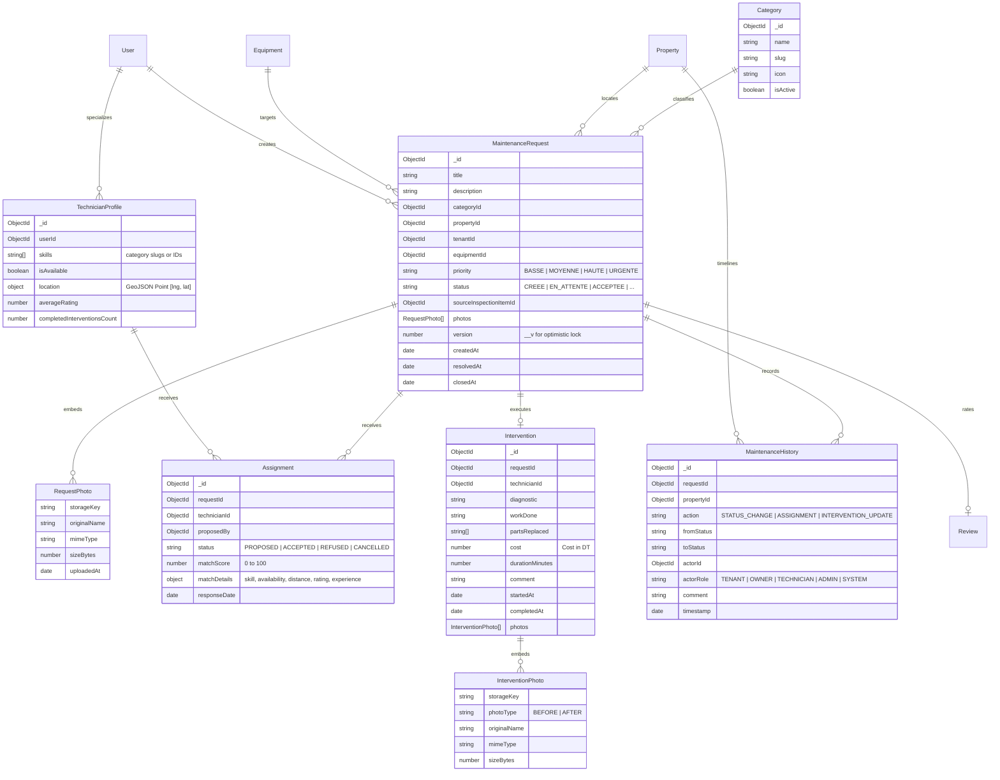

# HomeCheck Maintenance Module — Modèle de Données Entité-Relation

```mermaid
erDiagram
    Category ||--o{ MaintenanceRequest : classifies
    Property ||--o{ MaintenanceRequest : locates
    Equipment ||--o{ MaintenanceRequest : targets
    User ||--o{ MaintenanceRequest : creates
    MaintenanceRequest ||--o{ RequestPhoto : embeds
    MaintenanceRequest ||--o{ Assignment : receives
    MaintenanceRequest ||--o| Intervention : executes
    Intervention ||--o{ InterventionPhoto : embeds
    MaintenanceRequest ||--o{ MaintenanceHistory : records
    Property ||--o{ MaintenanceHistory : timelines
    User ||--o{ TechnicianProfile : specializes
    TechnicianProfile ||--o{ Assignment : receives
    MaintenanceRequest ||--o| Review : rates

    Category {
        ObjectId _id
        string name
        string slug
        string icon
        boolean isActive
    }

    MaintenanceRequest {
        ObjectId _id
        string title
        string description
        ObjectId categoryId
        ObjectId propertyId
        ObjectId tenantId
        ObjectId equipmentId
        string priority "BASSE | MOYENNE | HAUTE | URGENTE"
        string status "CREEE | EN_ATTENTE | ACCEPTEE | ..."
        ObjectId sourceInspectionItemId
        RequestPhoto[] photos
        number version "__v for optimistic lock"
        date createdAt
        date resolvedAt
        date closedAt
    }

    RequestPhoto {
        string storageKey
        string originalName
        string mimeType
        number sizeBytes
        date uploadedAt
    }

    Assignment {
        ObjectId _id
        ObjectId requestId
        ObjectId technicianId
        ObjectId proposedBy
        string status "PROPOSED | ACCEPTED | REFUSED | CANCELLED"
        number matchScore "0 to 100"
        object matchDetails "skill, availability, distance, rating, experience"
        date responseDate
    }

    Intervention {
        ObjectId _id
        ObjectId requestId
        ObjectId technicianId
        string diagnostic
        string workDone
        string[] partsReplaced
        number cost "Cost in DT"
        number durationMinutes
        string comment
        date startedAt
        date completedAt
        InterventionPhoto[] photos
    }

    InterventionPhoto {
        string storageKey
        string photoType "BEFORE | AFTER"
        string originalName
        string mimeType
        number sizeBytes
    }

    MaintenanceHistory {
        ObjectId _id
        ObjectId requestId
        ObjectId propertyId
        string action "STATUS_CHANGE | ASSIGNMENT | INTERVENTION_UPDATE"
        string fromStatus
        string toStatus
        ObjectId actorId
        string actorRole "TENANT | OWNER | TECHNICIAN | ADMIN | SYSTEM"
        string comment
        date timestamp
    }

    TechnicianProfile {
        ObjectId _id
        ObjectId userId
        string[] skills "category slugs or IDs"
        boolean isAvailable
        object location "GeoJSON Point [lng, lat]"
        number averageRating
        number completedInterventionsCount
    }
```
