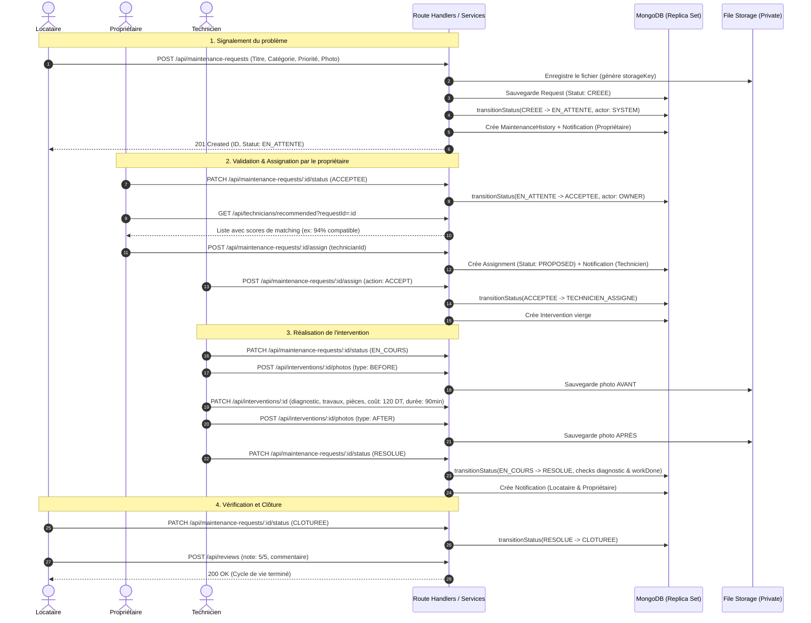

# HomeCheck Maintenance Module — Diagramme de Séquence de Bout en Bout

```mermaid
sequenceDiagram
    autonumber
    actor Tenant as Locataire
    actor Owner as Propriétaire
    actor Tech as Technicien
    participant API as Route Handlers / Services
    participant DB as MongoDB (Replica Set)
    participant Storage as File Storage (Private)

    %% 1. Report
    Note over Tenant,API: 1. Signalement du problème
    Tenant->>API: POST /api/maintenance-requests (Titre, Catégorie, Priorité, Photo)
    API->>Storage: Enregistre le fichier (génère storageKey)
    API->>DB: Sauvegarde Request (Statut: CREEE)
    API->>DB: transitionStatus(CREEE -> EN_ATTENTE, actor: SYSTEM)
    API->>DB: Crée MaintenanceHistory + Notification (Propriétaire)
    API-->>Tenant: 201 Created (ID, Statut: EN_ATTENTE)

    %% 2. Validation & Assignment
    Note over Owner,API: 2. Validation & Assignation par le propriétaire
    Owner->>API: PATCH /api/maintenance-requests/:id/status (ACCEPTEE)
    API->>DB: transitionStatus(EN_ATTENTE -> ACCEPTEE, actor: OWNER)
    Owner->>API: GET /api/technicians/recommended?requestId=:id
    API-->>Owner: Liste avec scores de matching (ex: 94% compatible)
    Owner->>API: POST /api/maintenance-requests/:id/assign (technicianId)
    API->>DB: Crée Assignment (Statut: PROPOSED) + Notification (Technicien)
    
    Tech->>API: POST /api/maintenance-requests/:id/assign (action: ACCEPT)
    API->>DB: transitionStatus(ACCEPTEE -> TECHNICIEN_ASSIGNE)
    API->>DB: Crée Intervention vierge

    %% 3. Intervention
    Note over Tech,API: 3. Réalisation de l'intervention
    Tech->>API: PATCH /api/maintenance-requests/:id/status (EN_COURS)
    Tech->>API: POST /api/interventions/:id/photos (type: BEFORE)
    API->>Storage: Sauvegarde photo AVANT
    Tech->>API: PATCH /api/interventions/:id (diagnostic, travaux, pièces, coût: 120 DT, durée: 90min)
    Tech->>API: POST /api/interventions/:id/photos (type: AFTER)
    API->>Storage: Sauvegarde photo APRÈS
    Tech->>API: PATCH /api/maintenance-requests/:id/status (RESOLUE)
    API->>DB: transitionStatus(EN_COURS -> RESOLUE, checks diagnostic & workDone)
    API->>DB: Crée Notification (Locataire & Propriétaire)

    %% 4. Closure & Feedback
    Note over Tenant,API: 4. Vérification et Clôture
    Tenant->>API: PATCH /api/maintenance-requests/:id/status (CLOTUREE)
    API->>DB: transitionStatus(RESOLUE -> CLOTUREE)
    Tenant->>API: POST /api/reviews (note: 5/5, commentaire)
    API-->>Tenant: 200 OK (Cycle de vie terminé)
```
