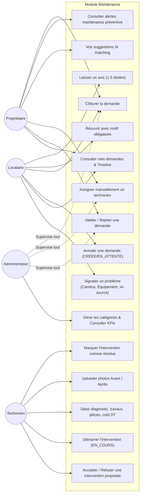

# HomeCheck Maintenance Module — Cas d'Utilisation

> **Acteurs** : Locataire, Propriétaire, Technicien, Administrateur

```mermaid
flowchart LR
    Tenant((Locataire))
    Owner((Propriétaire))
    Tech((Technicien))
    Admin((Administrateur))

    subgraph MaintenanceModule ["Module Maintenance"]
        UC1["Signaler un problème<br/>(Caméra, Équipement, IA-source)"]
        UC2["Consulter mes demandes & Timeline"]
        UC3["Annuler une demande (CREEE/EN_ATTENTE)"]
        UC4["Valider / Rejeter une demande"]
        UC5["Assigner manuellement un technicien"]
        UC6["Voir suggestions IA matching"]
        UC7["Consulter alertes maintenance préventive"]
        UC8["Accepter / Refuser une intervention proposée"]
        UC9["Démarrer l'intervention (EN_COURS)"]
        UC10["Saisir diagnostic, travaux, pièces, coût DT"]
        UC11["Uploader photos Avant / Après"]
        UC12["Marquer l'intervention comme résolue"]
        UC13["Clôturer la demande"]
        UC14["Réouvrir avec motif obligatoire"]
        UC15["Laisser un avis (1-5 étoiles)"]
        UC16["Gérer les catégories & Consulter KPIs"]
    end

    Tenant --> UC1
    Tenant --> UC2
    Tenant --> UC3
    Tenant --> UC13
    Tenant --> UC14
    Tenant --> UC15

    Owner --> UC2
    Owner --> UC4
    Owner --> UC5
    Owner --> UC6
    Owner --> UC7
    Owner --> UC13

    Tech --> UC8
    Tech --> UC9
    Tech --> UC10
    Tech --> UC11
    Tech --> UC12

    Admin --> UC16
    Admin -.->|Supervise tout| UC4
    Admin -.->|Supervise tout| UC5
    Admin -.->|Supervise tout| UC13
```
